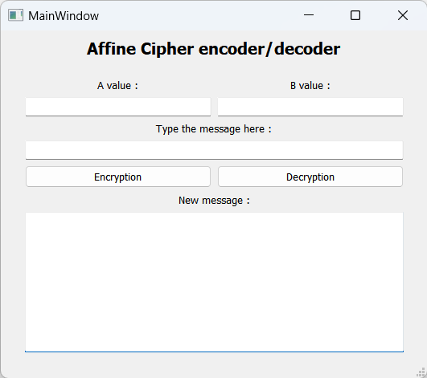

# Affine-Cipher-Encryption-Decryption
A monoalphabetic substitution cipher python application which encrypt and decrypt messages using an affine function

## Create the exe 
run this command in powershell at the location of the project:
```powershell
pyinstaller --clean --windowed --onedir --add-data='.\Affine_cipher.ui;.' .\Affine_Cipher.py
```
The executable file is now created in the dist/RSA folder.
## The application 

